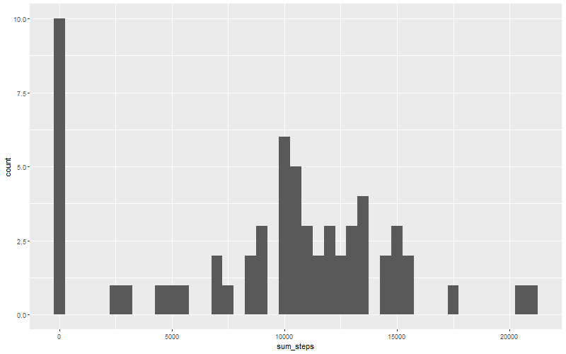
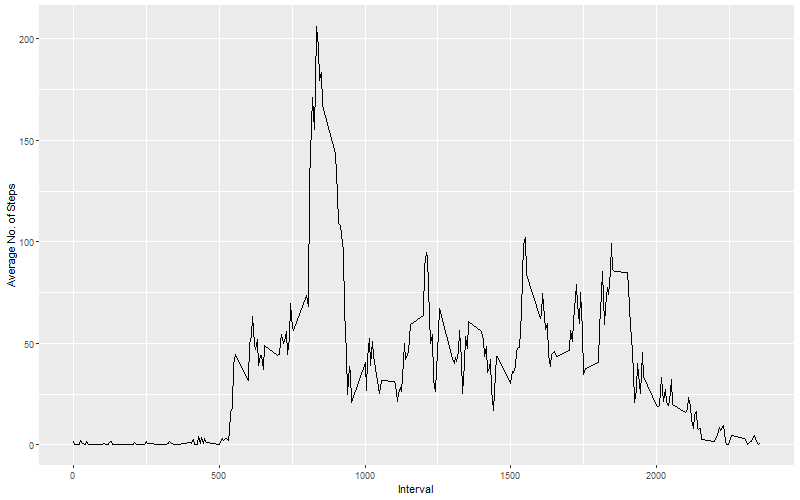
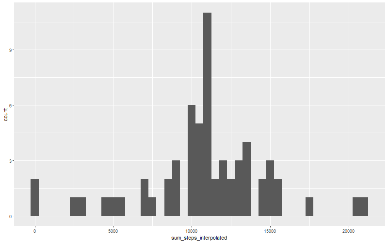
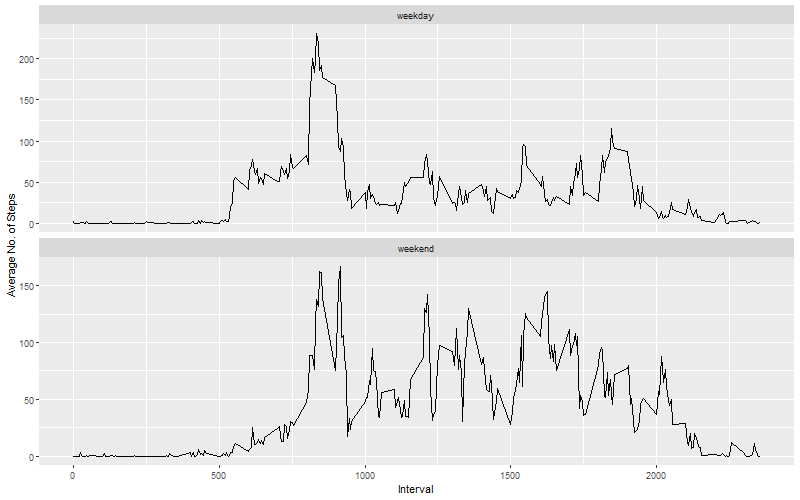

```r
##  load packages
library(tidyverse)
library(knitr)
library(kableExtra)
```


## Loading and preprocessing the data

```r
##  import csv file (use only relative paths since it is a project)
data <- read.csv("./activity/activity.csv")

##  convert column "date" (from factor to date)
data$date <- as.Date(data$date)
```


## What is mean total number of steps taken per day?

```r
##  total number of steps per day
steps_day <- data %>%
  group_by(date) %>% 
  summarize(sum_steps = sum(steps, na.rm = TRUE))

##  plot and save a histogram of steps per day
png(filename='./instructions_fig/histogram.png', width=800, height=500)
ggplot(steps_day, aes(x = sum_steps)) +
  geom_histogram(binwidth = 500)
dev.off()
```

```
## png 
##   2
```

```r
##  include the histogram

```


```r
##  calculate mean and median of steps over all days
mean_steps <- round(mean(steps_day$sum_steps, na.rm = TRUE), 2)
median_steps <- median(steps_day$sum_steps, na.rm = TRUE)
```

The mean of steps per day over all days is 9354, the median is 
10395.

## What is the average daily activity pattern?

```r
##  average steps per inteval
steps_interval <- data %>%
  group_by(interval) %>% 
  summarize(average_steps_interval = mean(steps, na.rm = TRUE))

##  plot and save time series plot
png(filename='./instructions_fig/time_series.png', width=800, height=500)
ggplot(steps_interval, aes(interval, average_steps_interval)) +
  geom_line() +
  xlab("Interval") +
  ylab("Average No. of Steps")
dev.off()
```

```
## png 
##   2
```

```r
##  include the time series plot

```


```r
##  subset row with maximum 5-minute interval
row_max_interval <- subset(steps_interval, 
                       average_steps_interval == max(average_steps_interval))

##  show the max interval
max_interval <- row_max_interval[1, 1]
```

The 5-minute-interval, which contains the most steps on average is 
835.

## Imputing missing values


```r
##  calculate no. of rows with NAs
no_NArows <- sum(!complete.cases(data[, 1:3]))
```

The number of rows, which contain at least one NA is 2304.

### Interpolation of missing values

For interpolation, I used the mean number of steps for each interval.


```r
##  create new dataset with mean no. of steps for each interval in order to 
##  replace NAs
data_interpolated <- data %>%
  group_by(interval) %>% 
  mutate(steps = ifelse(is.na(steps) == TRUE, mean(steps, na.rm = TRUE),
                        steps))

##  total number of steps per day (interpolated)
steps_day_interpolated <- data_interpolated %>%
  group_by(date) %>% 
  summarize(sum_steps_interpolated = sum(steps))

##  histogram including interpolated data
png(filename='./instructions_fig/histogram_interpolated.png', width=800, height=500)
ggplot(steps_day_interpolated, aes(x = sum_steps_interpolated)) +
  geom_histogram(binwidth = 500)
dev.off()
```

```
## png 
##   2
```

```r
##  include the histogram

```


```r
##  calculate mean and median of steps over all days (interpol)
mean_steps_interpolated <- round(mean(
  steps_day_interpolated$sum_steps_interpolated), 2)

median_steps_interpolated <- median(steps_day_interpolated$sum_steps_interpolated)
```

After interpolation and taking the mean for this task, the mean and median of 
steps per day over all days are the 
same: 10766.

## Are there differences in activity patterns between weekdays and weekends?


```r
##  add new column with "weekday" or "weekend" to interpolated data
data_interpolated <- data_interpolated %>% 
  mutate(day = as.factor(weekdays(date)))

data_interpolated <- data_interpolated %>% 
  mutate(week = as.factor(case_when(day %in% c("Samstag", "Sonntag") ~ "weekend",
                          day %in% c("Montag", "Dienstag", "Mittwoch", 
                                     "Donnerstag", "Freitag") ~ "weekday")))

##  average steps per interval and weekday respectively weekend
steps_interval_interpolated <- data_interpolated %>%
  group_by(interval, week) %>% 
  summarize(average_steps_interval = mean(steps, na.rm = TRUE))

##  plot and save time series plot
png(filename='./instructions_fig/time_series2.png', width=800, height=500)
ggplot(steps_interval_interpolated, aes(interval, average_steps_interval)) +
  geom_line() +
  xlab("Interval") +
  ylab("Average No. of Steps")+
  facet_wrap( ~ week, ncol = 1, scales = "free_y")
dev.off()
```

```
## png 
##   2
```

```r
##  include the time series plot

```


